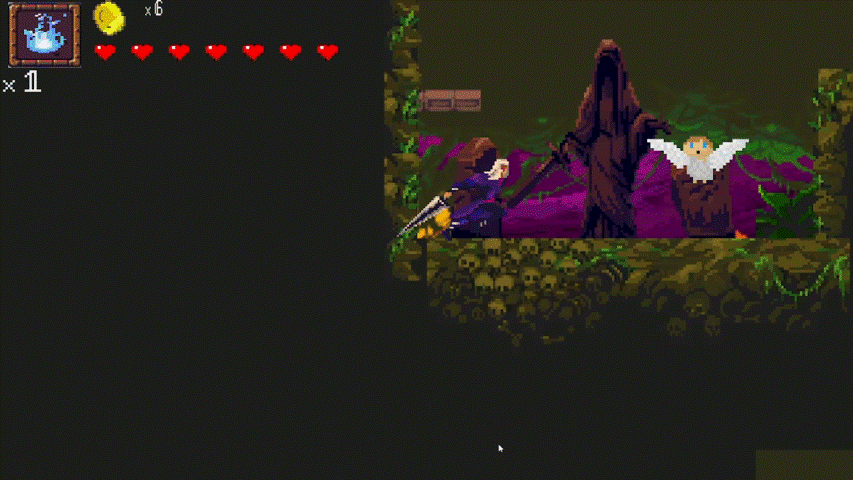

# Eclipse - Metroidvania 2D

> **Status:** Legacy Project (2021)
> **Tech Stack:** Unity 2D, C#, HLSL Shaders

Un juego de plataformas y exploración lineal estilo Metroidvania. Desarrollado originalmente como parte de mi formación en diseño de videojuegos, este proyecto demuestra la implementación de lógica compleja en C# y gestión de estados.

### 🎮 Demo & Gameplay
![Gameplay Demo]

<video controls src="Media/Eclipse.mp4" title="Title"></video>

### ⚙️ Highlights Técnicos (C# Development)
Este proyecto se centró en la arquitectura de software y optimización:
* **Finite State Machines (FSM):** Para la IA de los enemigos y el controlador del personaje.
* **Raycasting & Physics 2D:** Detección de colisiones personalizada para evitar "tunneling".
* **Tilemaps & Level Streaming:** Gestión eficiente de memoria para mapas grandes.

### 📥 Descarga (Build)
Puedes probar la versión compilada aquí:
https://github.com/kenner-letelier/Metroidvania_Unity_Proyectos-III-main/releases/download/v1.0/Build.Eclipse_Unity_Proyectos-III.rar